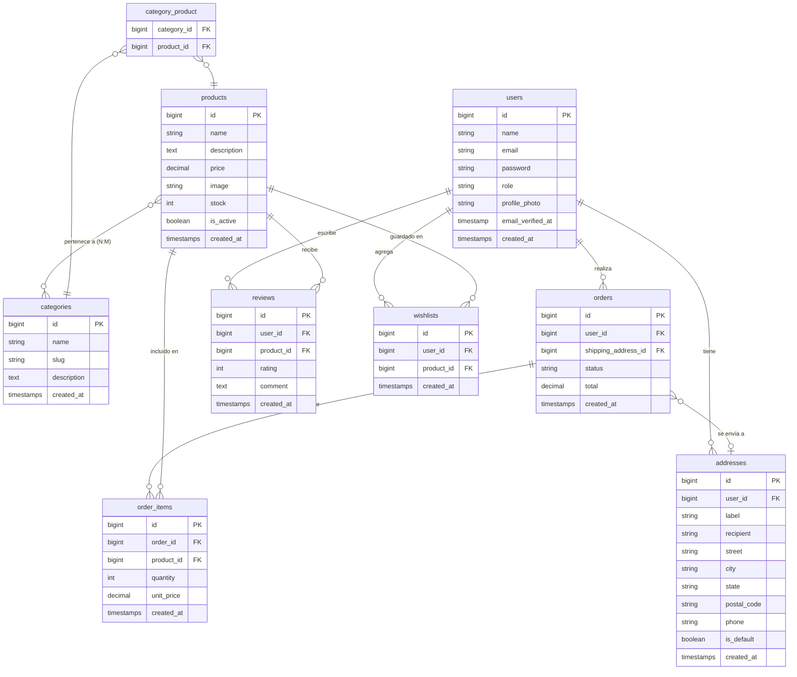

# Diagrama Entidad-Relación — PetFy Pet Shop

## Diagrama (Mermaid ERD)



## Descripción de relaciones

| Relación | Tipo | Descripción |
|----------|------|-------------|
| `users` → `orders` | 1:N | Un usuario puede tener muchos pedidos. |
| `users` → `addresses` | 1:N | Un usuario puede tener múltiples direcciones de envío. |
| `users` → `reviews` | 1:N | Un usuario puede escribir reseñas de varios productos. |
| `users` → `wishlists` | 1:N | Un usuario puede tener muchos productos en su wishlist. |
| `orders` → `order_items` | 1:N | Un pedido contiene uno o más ítems. |
| `orders` → `addresses` | N:1 | Cada pedido referencia la dirección de envío al momento del pedido (nullable). |
| `products` → `order_items` | 1:N | Un producto puede estar en muchos ítems de pedidos. |
| `products` → `reviews` | 1:N | Un producto puede tener muchas reseñas. |
| `products` → `wishlists` | 1:N | Un producto puede estar en las wishlists de muchos usuarios. |
| `products` ↔ `categories` | N:M | Un producto puede pertenecer a varias categorías; una categoría agrupa varios productos. Tabla pivote: `category_product`. |

## Estados del pedido

```
pendiente ──► procesando ──► enviado ──► entregado
    │               │
    └───────────────┴──► cancelado
```

- Las transiciones se validan en `App\Enums\OrderStatus` — las inválidas lanzan `DomainException`.
- "procesando" equivale funcionalmente a "pagado" (adoptado porque no hay pasarela de pago real).
